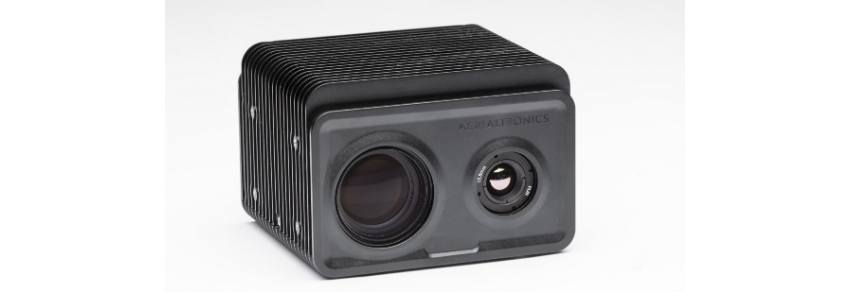
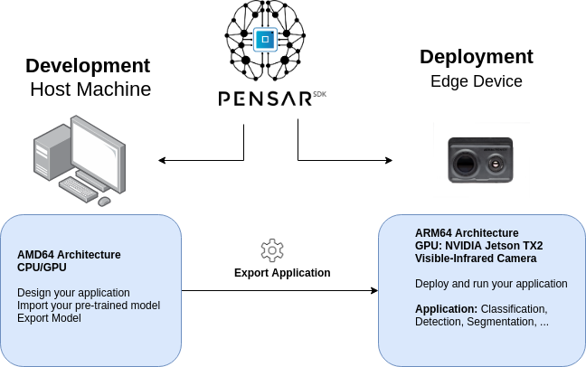
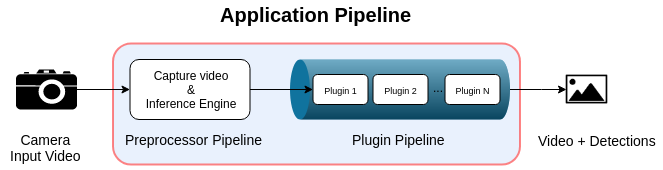
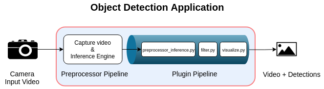

<!-- ---
title: Pensar SDK, A Rapid Artificial Intelligence Application Development framework
subtitle: A Software Development Kit (SDK) for rapid development of artificial based (AI) based Computer Vision (CV) application
layout: single
classes: wide
tags: [Computer Vision, Deep learning]
excerpt: "A Software Development Kit (SDK) for rapid development of artificial intelligence based Computer Vision  application"
header:
  image: pensarsdk/pensarsdk_logo_wide.png
author_profile: true
--- -->


# Pensar SDK, A Rapid Artificial Intelligence Application Development framework on the Edge Device

> A Software Development Kit (SDK) for rapid development of artificial based (AI) based Computer Vision (CV) application

**Note**: An online version of this article is published (including a demo) [here](https://medium.com/swlh/pensar-sdk-1-647f778bc11)

**This article is organized as follow:**

<!-- TOC depthFrom:1 depthTo:2 orderedList:false updateOnSave:false withLinks:false -->

    - Why Pensar SDK?
    - Features of Pensar SDK
    - The concept of Pensar SDK
    - Application Pipeline
    - Use-Case: Development of an Application for Object Detection

<!-- /TOC -->

In the past days I have been using and testing [Pensar SDK](https://pensarsdk.com/), a Software Development Kit (SDK) for rapid development of AI-based Computer Vision (CV) application. It allows the development of AI-based Computer Vision application that can easily be deployed on *Pensar*, an embedded camera developed by [Aerialtronics](https://www.aerialtronics.com/en/products/pensar), a manufacturer of unmanned aerial vehicles, commonly known as drones, for aerial photography and videography.


<p align="center">
  
</p>

In this article I give an overview of Pensar SDK and walk you through development of a demo application implementing object detection to be deployed on the camera _Pensar_.

## Why Pensar SDK?

The domain of Artificial Intelligence is increasingly expanding and has already started disrupting many industries. New deep learning models and use-cases are proposed on a daily basis. The amount of data is flourishing thanks to the availability of the data-generator devices, smartphones, IoT, drones, robots.... On the other side, companies like NVIDIA are pushing the boundaries of computing devices by developing powerful computing (a.k.a, Graphical Processing Unit: GPU) which are faster, smaller, energy-efficient, and cheaper.

One of the most important fields where AI is making a big step is Computer Vision. It is considered one of the most disrupting fields in today's world. It started little by little shifting many technologies across industries, from self-driving cars, smart city, video surveillance to robotics, transportation, defense and security, and more. To have an idea, here is a link on the latest workshop from the Computer Vision Foundation listing advanced research in the field: [CVPR 2019 Workshops](http://openaccess.thecvf.com/CVPR2019_workshops/menu.py)

If you are a data scientist working on an AI-based computer vision solution and have experience of deploying these models on an edge device (e, g, smart camera), you probably agree with me that this is time (and money) consuming and is no fun at all. Building your development environment from scratch could be a nightmare, especially when the edge device has multiple components. If you don't strategically plan your solution, you end up wasting too much time setting up a workable development environment, instead of focusing on unlocking information from your data and developing a fast and accurate solution for your business.

Practically speaking, not every business is able to do that for a lack of skill and knowledge. As a result, Pensar SDK is created to offer a resilient development and deployment solution for business. Pensar SDK is the first R(ai)AD, Rapid artificial intelligence Application Development framework. It is shipped with Pensar, an intelligent dual-camera based on the NVIDIA Jetson TX2. Pensar SDK's mission is to save time and help businesses to easily and rapidly develop an AI-based computer vision application.

<!-- Get started immediately with an application framework that takes care of cameras, recordings and communications for you.   Choose an inference engine, add your neural network or   choose from the shipped ones, add your own application   logic and GUI design via python-based plug-ins. All of this   while developing and testing from Visual Studio Code on your laptop and easily deploying on NVIDIA Jetson hardware. -->

## Features of Pensar SDK

Pensar SDK is more than a list of compiled libraries. It includes many features, among which:

-   A complete ready-to-use application framework
-   Enables deep learning inference at the edge
-   Plug and play pre-trained deep learning models
-   Compatible with Linux-based desktop machine (AMD64) and edge device (ARM64) powered with NVIDIA Jetson TX1/TX2
-   It supports most common Deep Learning and Computer Vision frameworks:
    -   Python/ C++ / Kivy
    -   OpenCV
    -   PyTorch
    -   TensorRT
    -   ...


-   Possibility to easily collect your data on the fly
-   and more features

## The concept of Pensar SDK

In the figure below I illustrate the workflow of development and deployment of an AI-based computer vision application using Pensar SDK

<p align="center">
  
</p>

Pensar SDK is installed on:

-   The host machine: from which the developer develop the application (design the application, import the trained neural network, ...) inside an environment that mimic the edge device
-   The Edge device: Pensar SDK needs to be installed on the edge device to ensure a resilent and easy deployment.

**Note**: Please note that Pensar SDK has no tool to help you train your neural network. To do that you can use tool such as Amazon AWS, Google cloud platform, Azure ...

## Application Pipeline

The figure below illustrates the application development pipeline:

<p align="center">
  
</p>


### Preprocessor pipeline

Here the trained deep learning model is parsed. The user can either use the installed one or import his trained model. The `preprocessor` takes care of all the hardware acceleration and optimization of AI/CV libraries.

### Plugin pipeline

This is the core of the application that the user must configure and personalized. It is a plugin-based structure, where the preprocessed video passes through each one of them.

<div class="page"/>

## Use-Case: Development of an Application for Object Detection

At the input, the application takes a video captured with the edge device (the camera Pensar of Aerialtronics) and outputs the same video with an overlay from the inference.

The figure below illustrates the application development pipeline:

<p align="center">
  
</p>

Let's see how this is done in practice on my laptop computer. I have Ubuntu 18.04 64-bits installed and NVIDIA GPU GeForce GTX 1660 Ti (I know it is not the best :)).

### Create the Application Folder

By running the script `new_app_skeleton.sh`, a new application folder is created with the name you enter. The folder is not empty, it contains a template application files that you have to edit and adapt to the desired application.

```bash
user@user-host-machine:~/pensarsdk/applications$ ./new_app_skeleton.sh

"This script can be used to create a new plugin-manager application
 skeleton with a custom name, based on the hello_world example.

The name must be given in snake case (https://en.wikipedia.org/wiki/Snake_case)
 and the script will take care of appropriate CamelCase conversion for class names.

The skeleton app will be composed of a single python plugin, with an
 empty .kv GUI file, no neural network application and will be
 equivalent in functionality to the hello_world application."

Please enter the name of the app you want to create:
my_app
```

The application folder is created with a path

```bash
~/pensarsdk/applications/my_app
```

### Launch VS Code from Inside the Development Environment

  To launch Visual Studio Code, simply enter in the terminal

```bash
 code .
```

### Configure the Application

We now have to configure the application. To do that simply edit the file `my_app.xml`, particularly, the `preprocessor_pipeline` and the `plugins_pipeline`.

```xml
<?xml version="1.0" encoding="UTF-8"?>
<plugin_manager_pipeline>

  # Insert a title for your application, simple text-markup can be used (i.e. [/b])
  <title>[b][color=ff0000]HelloWorld[/color][/b]</title>

  # Configure the preprocessor to perform inference using your neural network or ones of neural
  # networks included in the framework.
  # In this example we use YOLOv2-tiny included in the framework, it is based on DarkNet.
  <preprocessor_pipeline>
      <video_capture selected="0" />
      <neural_network type="Darknet" confidence="0.6" frame_resize="1.0" time_subsampling="1">

          # Specify configuration file (.cgf) and the weights file (.weights)
          <load_params>[darknet/yolov3-320.cfg, darknet/yolov3.weights]</load_params>

          # Specify label file, in this case we use COCO labels
	    <labels>darknet/coco.names</labels>

      </neural_network>
  </preprocessor_pipeline>

  # Insert plugins in the right order to build the processing pipe
  <plugins_pipeline>
      # Import library plugin (located in /usr/bin/pensarsdk/plugins/preprocessor_inference.py)
      <plugin modulename="preprocessor_inference" classname="PreProcessorInference" enabled="True" />

      # Add custom (user made) plugins. To be noticed that plugins can include a .kv if a GUI is needed.
      <plugin modulename="filter" classname="Filter" enabled="True">
          <config target_type="[ bottle, chair, tvmonitor, book, cup, keyboard ]"/>
      </plugin>
      <plugin modulename="visualize" classname="Visualize" enabled="True" />
  </plugins_pipeline>

</plugin_manager_pipeline>
```

### Create your Personalized Plugins

You can either use the predefined plugins or define yours. On the left of `VS Code` you find a list of all installed plugins under `Framework Plugins`, among which `pre_processor_inference.py`. You can also define your personalized plugins, in our case, `filter.py` and `visualize.py`.

-   `filter.py`:

    ```python
    from kivy.uix.boxlayout import BoxLayout
    from kivy.graphics.texture import Texture
    from kivy.properties import *
    from pluginmanager.utility import *
    import numpy as np
    import cv2

    # Name of the plugin: Filter
    class Filter(BoxLayout):
      name = "Filter"
      font_overlay = cv2.FONT_HERSHEY_SIMPLEX

      # GUI parameters
      label_text = StringProperty("Switch Filtering ON/OFF:")
      switch_active = BooleanProperty()
      labels_list = ListProperty()
      allowed_label = StringProperty()

      def onCreate(self, storage):
        self.labels_list = self.config['target_type']
        self.allowed_label = self.labels_list[0]
        self.switch_active = False

      def labelChange(self, label):
        self.allowed_label = label

      def process(self, primary_input_frame, secondary_input_frame, output_frame, frame_storage, storage):
        filtered_objects = []

        if ('object_locations' in frame_storage) and (frame_storage['object_locations']):
            cv2.putText(output_frame, "Detection", (50, 50),
                        self.font_overlay, 1.0, (0, 255, 0), 3, 8)

            for object_location in frame_storage['object_locations']:
                if self.switch_active == True:
                    cv2.putText(output_frame, "Object Filtering: ON",
                                (50, 80), self.font_overlay, 1.0, (0, 255, 0), 3, 8)
                    if object_location['label'] == self.allowed_label:
                        filtered_objects.append(object_location)
                else:
                    cv2.putText(output_frame, "Object Filtering: OFF",
                                (50, 80), self.font_overlay, 1.0, (0, 0, 255), 3, 8)
                    filtered_objects.append(object_location)

            frame_storage['filtered_objects'] = filtered_objects
        else:
            cv2.putText(output_frame, "No Detection", (50, 50), self.font_overlay, 1.0, (0, 0, 255), 3, 8)
    ```

-   `visualize.py`:

    ```python
    class Visualize(BoxLayout):
       name = "Visualize"

       # GUI parameters
       label_text = StringProperty("Display overlay:")
       switch_active = BooleanProperty()

       def process(self, primary_input_frame, secondary_input_frame, output_frame, frame_storage, storage):
           """
           This method performs visualization of overlays for each detected object in each frame image.
           It uses OpenCV function to draw a rectangle and adds a text to display the confidence of the detection.
           """

           if not 'filtered_objects' in frame_storage:
               print('No object detected')
               return

           for filtered_object in frame_storage['filtered_objects']:
             if self.switch_active:
               roi = filtered_object['roi']
               pt1 = (roi[0],roi[1])
               pt2 = (roi[2],roi[3])
               ptText = (roi[0], roi[1] - 20)
               colorOverlay = (0,0,255)
               fontOverlay = cv2.FONT_HERSHEY_SIMPLEX
               textOverlay = "{0:s} {1:2.2f}%".format(filtered_object['label'], filtered_object['confidence']*100)

               cv2.rectangle(output_frame, pt1, pt2, colorOverlay, -4, 8)
               cv2.putText(output_frame, textOverlay, ptText, fontOverlay, 1.0, colorOverlay, 3, 8)
    ```

### Personalize the GUI

Say we want to personalize the GUI of the application, for instance, I want to create a button to turn on/off filtering and add a spinner to select the label of the object of interest. To do that you need to create and edit a kivy file for each desired plugin, in our case `filter.py` and `visualize.kv`.

-   `visualize.kv`:


    	<Visualize@BoxLayout:
			 orientation: "horizontal"
			 size_hint: 1, 1

			 switch_active: enable_switch.active

			 Label:
				 size_hint: 0.5, 1
				 text: root.label_text

			 Switch:
    			 id: enable_switch
    			 size_hint: 0.5, 1
    			 active: True


-   `filter.kv`

    	<Filter@BoxLayout>:
    	    BoxLayout:
    	        orientation: "horizontal"
    	        size_hint: 1, 1
    	        height: '48dp'

    	        switch_active: enable_switch.active

    	        # Give lable
    	        Label:
    	            size_hint: 1, 1
    	            text: root.label_text
    	            markup: True
    	            text_size: self.size
    	            halign : 'center'
    	            valign : 'center'

    	        # Create switch
    	        Switch:
    	            id: enable_switch
    	            size_hint: 1, 1

    	            active: True if root.switch_active == True else False
    	            on_active: root.switch_active = self.active

    	        Spinner:
    	            id: labels_spinner
    	            size_hint : (0.5, 0.5)

    	            pos_hint: {'x': .5, 'y':.5}
    	            # size: 100, 44

    	            values: root.labels_list
    	            text: root.allowed_label
    	            on_text: root.labelChange(self.text)


### Run the Application

To run the application, two choices are possible, either:

-   use the debug mode by pressing F5 then again F5 to launch the application.

-   Or, you can run the application directly from the application folder

    ```bash
    run_pensar.sh -a my_app.xml
    ```

A GUI should pop-up in full screen running the created
<p align="center">
  
</p>


**Note**: This GUI is created and adapted for Aerialtronics camera, Pensar, notice the setup for the twin cameras. Thanks to Pensar SDK, we can develop and test the application on the host machine before deployment on the camera.


<div class="page"/>

### What to do next?

-   Let me know what you think in the comment section and/or direct message me on [LinkedIn](https://www.linkedin.com/in/aminehy/).
-   Visit the official website [https://pensarsdk.com/](https://pensarsdk.com/) to learn more about this solution.

-   You are a professional and you are interested in Pensar SDK solution, please feel free to contact Aerialtronics staff [here](<https://pensarsdk.com/>).

### Want to read more ?
Checkout my past articles on [medium](https://medium.com/@Amine_hy):

  -   [Have you Optimized your Deep Learning Model Before Deployment?](https://towardsdatascience.com/have-you-optimized-your-deep-learning-model-before-deployment-cdc3aa7f413d)

  -   [Deep Learning for image classification w/ implementation in PyTorch](https://towardsdatascience.com/convolutional-neural-network-for-image-classification-with-implementation-on-python-using-pytorch-7b88342c9ca9)
